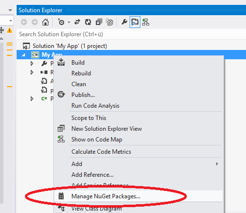
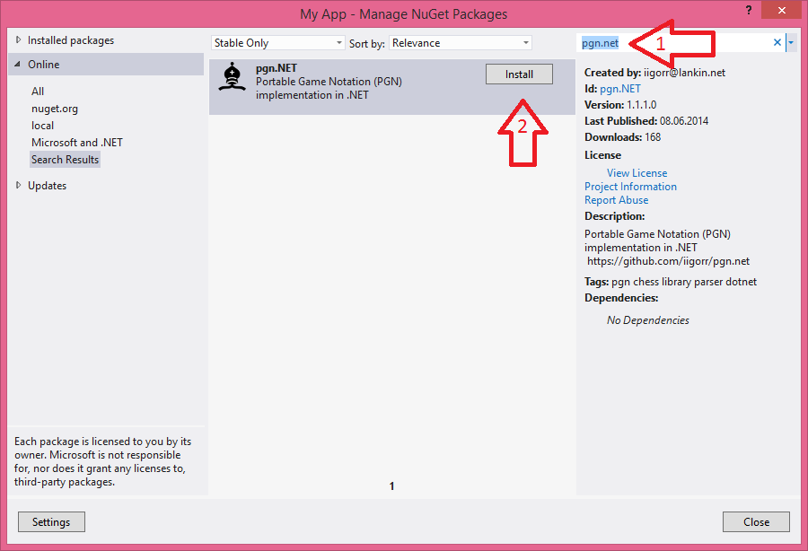

pgn.net 
=======

Portable Game Notation (PGN) implementation in .NET

## About PGN

Read more about [PGN on Wikipedia](http://en.wikipedia.org/wiki/Portable_Game_Notation).

Here is an excellent [spec document](http://www.saremba.de/chessgml/standards/pgn/pgn-complete.htm).


## About pgn.NET

pgn.NET is a library which can be used to handle chess games and read/write them in the PGN format. It is implemented in F# and C# and uses [FParsec](http://www.quanttec.com/fparsec/).

To support as many .pgn file formats as possible the parsers try to be as tolerant as possible. It mostly conforms to [this specs](http://www.saremba.de/chessgml/standards/pgn/pgn-complete.htm).
However, other than the specification says we use UTF-8 as encoding, cause it's the 21st century.


## How To Use

``` csharp
using ilf.pgn;
using ilf.pgn.Data;

// ...

//READ FILE
var reader = new PgnReader();
var gameDb = reader.ReadFromFile("Tarrasch.pgn");

Game game = gameDb.Games[0];

Console.WriteLine(game);
```

## Installation
You can download the [NuGet Package](https://www.nuget.org/packages/pgn.NET/) or just clone, build and reference the assemblies.

### NuGet package via console:
``` powershell
PM> Install-Package pgn.NET
```

### NuGet package in Visual Studio:

Choose your project and open the NuGet Package Manager:


Search for "pgn.net" in the online directory, then click "Install" on the pgn.net package:


The project should now reference the pgn.NET assembly


## How To Contribute

1. Fork
1. Clone
1. Code
1. Create Pull Request


## Changelog

### Bugfix Release 1.1.1

* Bugfix: Castle should use the letter O rather than the digit 0 (https://github.com/iigorr/pgn.net/issues/10)
* Bugfix: parser recognizes bxc6 as "Bishop captures c6" (https://github.com/iigorr/pgn.net/issues/11)
* FSharp.Core is merged in into the assembly
* Removed support for wp71 due to FParsec incompatitbilities

### Release 1.1
* Bugfix: zero-length move text bug (IndexOutOfRange)
* Introduce MoveTextEntryList, a MoveEntry list which provides simplifed access to moves. 
* Change type of Game.MoveText and RAVEntry.MoveText to MoveTextEntryList
* Add missing API doc
* Add support for frameworks: net40, net45, wp71

### Release 1.0

This is the initial release of pgn.NET, a library to parse PGN chess databases which includes

* Data model for chess games (Game, Board, move text, move, piece)
* PgnReader (Parser) for the PGN format (http://www.saremba.de/chessgml/standards/pgn/pgn-complete.htm).
  - The parser tries to be as tolerant as possible (there are many variation of the pgn format),
    so most pgn files should be readable. If not, please file an issue here: https://github.com/iigorr/pgn.net/issues
  - Support for iso-8859 and UTF-8
  - Support for Recursive Annotation Variation (RAV)
  - Support for Forsyth-Edwards-Notation (FEN, http://de.wikipedia.org/wiki/Forsyth-Edwards-Notation)
* PgnWriter, formatter for PGN games. 


